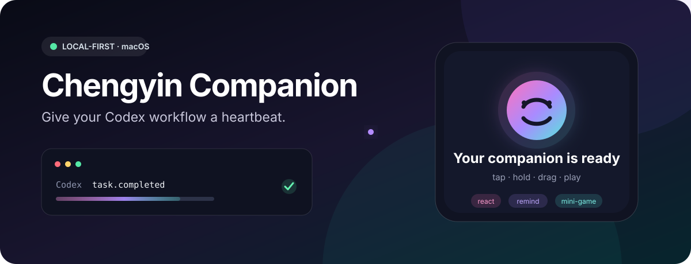

# 澄音 Companion

简体中文 · [English](README.en.md)



[](docs/COMPATIBILITY.md)
[](docs/COMPATIBILITY.md)
[](Package.swift)
[](LICENSE-SCOPE.md)

让 Codex 的工作节奏变成一个看得见、可以逗玩的 macOS 桌面伴侣：任务结束时回应你，工作久了提醒休息，空闲时可以轻点、长按、拖拽或玩小游戏。默认本地运行，不录音、不上传代码，也不要求账户。

**[两分钟体验](https://github.com/daishengyong/chengyin-companion#两分钟体验推荐直接交给-codex)** · **[第一次怎么玩](https://github.com/daishengyong/chengyin-companion#第一次怎么玩)** · **[内容包](docs/PACK-SPEC-v2.md)** · **[参与贡献](CONTRIBUTING.md)** · **[交流玩法](https://github.com/daishengyong/chengyin-companion/discussions)** · **[问题反馈](https://github.com/daishengyong/chengyin-companion/issues)**

## 现在可以得到什么

| 能力 | 当前公开仓库状态 |
| --- | --- |
| 三种桌面形态、手势反馈、提醒与六个小游戏 | 可构建、可运行 |
| Content Pack v1/v2 创建、审计、导入与失败回退 | 可用 |
| 无账户、无麦克风、无遥测的本地运行 | 可用 |
| 动态系统图形回退 | 默认包含 |
| 完整人物视频、语音和品牌 Starter | 未公开，仍在逐项权利审阅 |
| 面向普通用户的 Developer ID 签名、公证 DMG | 准备中，不能用未签名预览冒充正式版 |

公开仓库是完整的 **MIT 代码版**，不是三分钟试用；只是不会夹带权利未通过的真人或品牌素材。你可以立即体验交互逻辑，也可以导入自己拥有使用权的 Content Pack。具体范围见[公开无媒体模式](PUBLIC-CODE-ONLY.md)和[许可证范围](LICENSE-SCOPE.md)。

## 两分钟体验：推荐直接交给 Codex

复制下面整段给 Codex。它会先检查环境，再克隆、构建、安装和启动；不会使用 `sudo`、调用 Seedance/TTS、读取 API Key 或修改 `~/.codex/config.toml`。

```prompt
请帮我安装并启动 Chengyin Companion 的公开源码预览：
https://github.com/daishengyong/chengyin-companion

要求：
1. 确认这是 Apple Silicon Mac、macOS 14+，并检查 Xcode Command Line Tools 和 Python 3.9+。
2. 如果 ~/ChengyinCompanion 不存在，就克隆到这里；如果目录已存在且有未提交修改，不要覆盖，改用新的临时克隆。
3. 先运行 ./scripts/bootstrap-local.sh --check-only。
4. 只有预检通过后才运行 ./scripts/bootstrap-local.sh，安装并启动应用。
5. 不使用 sudo，不绕过 macOS 安全机制，不读取或上传密钥，不调用 Seedance/TTS，不修改 ~/.codex/config.toml。
6. 最后告诉我安装版本、应用位置、是否成功启动，以及仍然待完成的公开发行边界。
```

手动安装只需：

```bash
git clone https://github.com/daishengyong/chengyin-companion.git ~/ChengyinCompanion
cd ~/ChengyinCompanion
./scripts/bootstrap-local.sh --check-only
./scripts/bootstrap-local.sh
```

源码安装会创建本机 ad-hoc 开发构建，因此不是已公证的公开 DMG。它不会自动改写 Codex 全局通知配置；先用 `Command + Shift + R` 预览任务完成庆祝，其他互动可直接使用。完整步骤、恢复和常见问题见[新用户快速上手](docs/QUICKSTART.zh-Hans.md)。

## 第一次怎么玩

| 操作 | 反馈 |
| --- | --- |
| 单击角色 | 当前时段的短回应 |
| 双击角色 | 打开生活或幻想场景 |
| 长按后松开 | 抚摸反馈和随机亲密动作 |
| 拖拽或快速甩动 | 抱起、惯性、声音与屏幕边缘吸附 |
| `Command + Shift + M` | 在头像、半身和全屏之间切换 |
| `Command + Shift + G` | 开始“20 秒抓住我” |
| 点击魔术棒 | 一次看到动作、场景和小游戏入口 |

公开代码版使用动态系统图形代替尚未公开的人物视频；安装你自己的合法 Content Pack 后，同一套交互会自动使用对应视频、音轨、构图和失败回退。

## 开发者快速入口

不安装到 `/Applications`，只启动当前克隆的预览：

```bash
./scripts/preview-local.sh
```

最快的离线贡献预检：

```bash
./scripts/check-contribution.py --profile quick --json
python3 scripts/audit-public-source-secrets.py --json
```

整个源码流程不调用 Seedance/TTS、不读取 API Key、不申请麦克风、不创建账户，也不上传诊断。Python 兼容性、零授权审计和隔离源码包验证见[新用户快速上手](docs/QUICKSTART.zh-Hans.md)。

## 项目蓝图

- [普通用户安装、试玩与恢复](docs/QUICKSTART.zh-Hans.md)
- [本地优先、无收费/账户/广告/自动分享边界](docs/PRODUCT-BOUNDARY.zh-Hans.md)
- [Codex 伴侣产品与工程架构](docs/CODEX-PRODUCT-ARCHITECTURE.md)
- [全球原创角色与 Seedance 内容系统](docs/GLOBAL-PERSONA-SYSTEM.md)
- [代码、Starter、社区媒体与角色权利边界](docs/LICENSING-AND-RIGHTS.md)
- [Seedance Mini 本地计费硬保护](docs/SEEDANCE-BILLING-SAFETY.md)
- [Seedance B0 原创角色 Pilot 与真实成本](docs/pilots/SEEDANCE-B0-PILOT.md)
- [全球化与本地化计划](docs/LOCALIZATION-PLAN.md)
- [Chengyin Content Pack v1](docs/PACK-SPEC-v1.md)
- [贡献者架构地图](docs/CONTRIBUTOR-ARCHITECTURE.md)
- [Core 与 App 模块边界契约](docs/CORE-MODULE-BOUNDARY.zh-Hans.md)
- [兼容策略](docs/COMPATIBILITY.md)
- [稳定错误码与隐私安全故障说明](docs/ERROR-CODES.md)
- [Chengyin Experience Pack v2](docs/PACK-SPEC-v2.md)
- [新 Mac 首次使用与低动态效果审计](docs/FIRST-USE-AND-LOW-IMPACT-AUDIT.md)
- [英文首次使用五步视觉审计](docs/ENGLISH-FIRST-USE-VISUAL-AUDIT.zh-Hans.md)
- [发行就绪状态与人工所有者门](docs/RELEASE-READINESS-STATES.md)
- [社区内容包审阅索引 v1](docs/COMMUNITY-PACK-INDEX.md)
- [可验证源码预览包契约](docs/SOURCE-PACKAGE-CONTRACT.zh-Hans.md)
- [内置 Starter 素材的来源、权利与无障碍契约](docs/STARTER-MEDIA-CONTRACT.zh-Hans.md)
- [本地构建、更新与回滚](docs/LOCAL-UPDATE.md)
- [不安装的一键项目预览](docs/LOCAL-PREVIEW.zh-Hans.md)
- [Codex × Seedance 桌面伴侣节目制作包](docs/show/README.md)
- [贡献指南](CONTRIBUTING.md)
- [安全政策](SECURITY.md)
- [公开路线图](ROADMAP.zh-Hans.md)
- [项目治理](GOVERNANCE.zh-Hans.md)
- [社区行为规范](CODE_OF_CONDUCT.zh-Hans.md)
- [支持与问题报告](SUPPORT.zh-Hans.md)

## 完整产品能力

以下是源码中已经实现并持续验证的完整能力。公开代码版缺少权利待审的内置人物媒体，
因此默认使用动态系统图形；导入合法 Content Pack 后由同一套运行时驱动视频和声音。

- 原生 AppKit 浮动面板承载 SwiftUI 内容
- 不录音、不听写、不建立聊天线程，也不申请麦克风权限
- 全屏互动舞台、右下角半身陪伴、迷你动态头像三种形态
- 全屏窗口默认透明；空闲时保留轻量控制层，触发互动后只显示中央的纯净视频
- 背景可在透明、影院与柔暗之间切换；系统“减少透明度”会把影院模式安全降为柔暗，增强对比度会提高衬底可读性
- 可选择跟随当前窗口、主显示器或指定显示器；拔掉指定屏幕后会回到当前／主屏，不会把头像和全屏舞台留在屏幕外
- AppKit 浮动面板使用跨 Space／全屏覆盖契约，并监听取消隐藏与显示器拓扑变化；每 5 秒轻量复核一次窗口策略，不解码媒体、不抢焦点，也不覆盖用户主动最小化。
- 头像、半身和全屏复用同一组 720p 横屏视频：内容包可用随时间移动的焦点轨道保持角色在小头像内，舞台与全屏保留更完整画面
- 默认“音画同步”播放 Seedance 原生台词、口型、动作和环境声；按钮可切到“仅声音”TTS
- 保存窗口形态、外观、显示器目标、宠物位置、最近响应与声音偏好；显示器名称不会进入持久化或诊断
- 内置 159 条火山 Seed-TTS 2.0「魅力女友」预生成语音，其中 63 条用于直接操控和小游戏，48 条用于护眼、专注、午晚餐与精确报时
- 喝水、伸展、鼓掌、跳跃、转圈、大笑、比心、飞吻、加油九种大动作
- “逗她玩”菜单可直接点播九种独立的 Seedance 原生音画互动视频
- 厨房偷喂、床边留位、健身陪练、梳妆飞吻四种“迷你生活”场景
- 四种迷你生活视频由 Seedance 2.0 Mini 一次生成画面、台词、口型、动作和环境声
- 小头像空闲轮播迷你生活时保持静音，主动点播时自动展开并播放原生同步音轨
- 月面轨道、海底玻璃房、时间静止咖啡馆和雨夜传送门四种 16:9 幻想场景
- 玫瑰丝缎、元气运动、夜色约会三套成年虚构角色造型随机轮换
- 透明背景桌面角色，不再显示方形人物卡
- 约 100px 的头像持续轮播同一组横屏动态母片的中心构图，不再使用严肃静态圆形照片
- 新安装默认从迷你头像开始，鼠标移入后按轻点、双击、长按、拖动逐项教学；已有用户保存的窗口形态不会被改写
- 头像可直接逗玩：单击按时段选择明确的回应动作，双击进入陪伴/幻想场景，并自动避开最近重复内容；喝水、活动、健身和时间主题只留给周期关心或魔术棒点播，不会伪装成点击回应
- 头像、半身与全屏角色区域都支持鼠标跟随、长按抚摸和拖拽反馈
- 长按开始有短语和触觉反馈，松手后随机播放飞吻、比心或大笑的 Seedance 原生音画视频
- 短距离拖拽让角色倾斜抵抗并回应，超过 24px 后用“抱起”短语和触觉反馈移动宠物窗口
- 快速甩动、向上举高、放稳和边缘吸附都有独立随机短语；拖到屏幕边缘会磁吸并记住位置
- 内置“20 秒抓住我”小游戏：头像随机跳到九个屏幕位置，记录抓取、连击、倒计时与最高进度
- 20 秒内抓到 5 次会自动展开并播放 Seedance 原声音画庆祝视频，任务完成事件会在本局或短语结束后继续播
- 内置“边缘躲猫猫”：头像随机藏到屏幕四边，左右露出约 48px、上下露出约 112px，确保探头区域始终可以点击；连续找到 5 次会播放 Seedance 飞吻奖励视频
- 内置“动作连招”：20 秒内依次完成轻点、长按和快速甩动，每一步都有语音与触觉确认，接完整后播放隐藏转圈奖励视频
- 内置“画心挑战”：在纯净半身舞台按住底部发光点，沿九个节点连续画出心形；中途松手会重置，完成后播放原声音画比心奖励
- 内置“心跳节拍”：头像发出八次粉色脉冲与双重低频心跳音，踩中至少六拍且保持三连击会播放原声音画跳跃奖励
- 内置“投喂时刻”：把草莓、蛋糕、拿铁或巧克力拖进她怀里的发光区域；连续投喂三次后播放厨房原声音画惊喜
- 单击、长按松手、甩动、菜单点播和任务收尾进入视频时自动隐藏工具栏、字幕卡、说明文字与装饰边框，播完恢复控制
- 半身与全屏空闲状态使用同一组自然呼吸、场景动作和电影感环境视频
- 播放器以真实可见首帧计时，最多预热四项本地素材；隐私最小诊断只显示首帧 P95、失败数和并发峰值，不包含视频路径或素材名称。当前 Mac 的 30 分钟无界面媒体 soak 已通过（26 项素材、737,616 帧、解码首帧 P95 23ms、峰值常驻增长 28.03MB）；这与真实窗口首帧、GPU 和人工音画同步抽查仍明确分层。
- 头像模式播报时自动展开半身，动作和语音结束后自动缩回
- 头像模式点播迷你生活时自动展开半身，原生台词播完后自动缩回
- 从头像点击幻想场景时自动展开到半身横屏，播放完恢复头像；半身和全屏保持当前形态
- 如果点击后只有声音，表示当前明确处于“仅声音”模式；点击播放模式图标选择“音画同步”，或在魔术棒菜单顶部选择“恢复音画互动”。播放模式改为显式二选一，不再因误点图标直接切换。
- 魔术棒使用向上展开的四标签固定面板；小游戏、迷你生活、幻想场景与动作一次完整显示，不需要滚轮。连续点播仍记得最初头像形态，素材失败时会在原画面内接本地回退，结束后再统一缩回。
- 直接点击与周期关心使用分离的候选池；报时、喝水、活动、任务终态与小游戏短句不能混入头像点击。
- 只有内置终态发射器 `terminal-events-v1` 的显式 `task.completed + success` 才庆祝；任意本地 JSON 或 Codex turn 边界只能降级为“回复就绪”，启动前遗留事件只建立去重基线，旧日志监听默认关闭
- “共同工作日”只保存开始、回复、完成、受阻、恢复次数与累计时长；应用重启后仍记得今天的节奏，但没有字段可保存任务标题、代码、Prompt 或路径。加载会明确区分主记录、回滚副本与安全默认值；保存失败不阻断真实任务反馈，只显示稳定错误码。
- 顶部工作日状态显示今天共同完成次数；跨日自动清零，不制造断签、掉级或补签压力
- 点击顶部工作日状态可查看当天汇总与隐私边界；“忘记今天”会同时清除主记录和回滚副本，后续重启不会恢复已删除数据
- 设置中的“忘记所有共同回忆”会清除共同瞬间、纪念物、惊喜进度和播放历史，并同步删除回滚副本；用户选择的陪伴语气作为偏好保留
- `response.ready` 受本地打扰预算控制：短时间连续 Codex 回合、安静时段或正在互动时只给轻量提示，不再排队播放整段音画；可信完成事件不受此限制
- 工作、生活关心、逗玩和环境存在感先经过同一个体验导演：用户操作即时响应，真实任务终态在忙碌时可靠排队，低优先级关心不会叠在小游戏或视频后追着播放
- 独立于 Codex 的生活节奏包含早安、补水、久坐、护眼、专注鼓励、午餐、整点/半点、晚间收尾和深夜休息，并跨应用更新保留进度
- 主动关心提供安静、标准、积极三档，支持 23:30–8:30 静默、暂停 30 分钟/1 小时/今天，以及可见的下一次关心时间
- 可选“登录时自动启动”，由 macOS 登录项管理

## 快捷操作

- `Command + Shift + M`：循环切换三种形态
- `Command + Shift + 1 / 2 / 3`：头像 / 半身 / 全屏互动舞台
- `Command + Shift + R`：预览任务完成庆祝
- `Command + Shift + P`：预览随机动作和语音
- `Command + Shift + G`：开始或结束“20 秒抓住我”
- `Command + Shift + K`：开始或结束“边缘躲猫猫”
- `Command + Shift + J`：开始或结束“轻点→长按→甩动”动作连招
- `Command + Shift + H`：开始或结束“画心挑战”
- `Command + Shift + B`：开始或结束“心跳节拍”
- `Command + Shift + F`：开始或结束“投喂时刻”
- 单击角色：触发符合当前时段的短反应
- 双击角色：进入符合当前时段的生活或幻想场景
- 长按角色：开始播放抚摸短语，松手后播放一条随机亲密动作视频
- 短距离拖动：角色原地倾斜并发声；超过 24px 后用抱起反馈移动窗口
- 快速甩动或拖到屏幕边缘：播放对应短语、触觉反馈，并惯性响应或磁吸停靠
- 右键可切换形态、预览动作或退出

## 显式本地任务事件

项目已经加入 `Companion Event Protocol v1`。事件最大 64 KiB，默认拒绝带任务标题、
代码、Prompt、路径或个人信息的 payload。可用以下命令把一次隐私安全的模拟完成事件写入
临时目录（不会触发正式应用）：

```bash
CHENGYIN_EVENT_ROOT="$(mktemp -d)" swift run CompanionEventEmitter task.completed 1000
```

生产 adapter 未设置 `CHENGYIN_EVENT_ROOT` 时，事件才会原子写入当前用户的
`Application Support/Chengyin/events`；验证命令必须使用临时目录，避免测试庆祝混入正式体验。
应用读取这个公开 envelope；直接观察 `~/.codex/sessions` 的旧兼容器默认关闭，因为其中的
`task_complete` 只是 turn 边界，不能证明用户目标完成。

官方 Codex `notify` 的 mapper 也可本地验证：

```bash
CHENGYIN_EVENT_ROOT="$(mktemp -d)" swift run CompanionEventEmitter codex-notify \
  '{"type":"agent-turn-complete","cwd":"/discarded","input-messages":["discarded"],"last-assistant-message":"discarded"}'
```

它只把官方 `agent-turn-complete` 转为中性的 `response.ready`（“Codex 有新结果”），不会把一次 turn 结束误报成整个任务成功；同时丢弃工作目录、输入、回复正文和上游 ID。正式安装只会在用户看见精确配置并确认后写入用户级 Codex 配置；已有 `notify` 时不会覆盖。完整能力边界见[Codex 产品与工程架构](docs/CODEX-PRODUCT-ARCHITECTURE.md)。

可选的 App Server 单通知入口也已实现：`turn/started` 映射开始，失败与中断映射真实终态，而 `completed` 仍只表示 `response.ready`。它不启动或管理 App Server；隐私投影、验证方法和未完成边界见 [App Server 适配器合同](docs/CODEX-APP-SERVER-ADAPTER.zh-Hans.md)。

合约检查：

```bash
swift run CompanionContractChecks
```

## 内容包与恢复

Content Pack v1/v2 已经贯穿本地运行时，而不只是 manifest 校验：

- staging 后逐文件哈希、路径、文件类型、大小和 trigger 校验，并用系统媒体框架核验 codec、时长、尺寸、音轨声明与首个可见帧；
- 内置、社区与本地包分别经过清单、权利和信任门；旧 schema 的 `paid` tier 仅为兼容解析，当前没有权益提供者或购买入口，因此始终安全拒绝；
- 不可变版本目录 + 原子 `active.json`，升级失败不改变当前版本；
- 已安装且未禁用的视频按 trigger 与语言进入播放器，Starter Bundle 永远是回退；
- 新版本首播实际推进后标记健康；首播失败回滚上一版，首装坏包则禁用；
- 设置页可显式导出和检查后恢复便携备份；只包含陪伴偏好、四项手势学习进度与活动内容包，不导出共同回忆、鼠标轨迹、Codex 会话、Prompt、任务、代码、路径或事件。
- 设置页可一键复制隐私最小诊断，便于提交 Issue；报告不含用户名、路径、任务内容、Prompt、代码、事件历史、共同回忆、内容包标识或密钥，且绝不自动上传。
- 内容包与备份失败会显示双语恢复建议和稳定错误码；错误码可安全粘贴到 Issue，界面不会直接暴露可能包含本机绝对路径的系统错误。
- 设置页“本机健康”核对安装身份、Starter 音画、Codex 本地事件桥、内容库与无麦克风边界，并显示首帧 P95、失败数和并发峰值。只有事件目录权限收紧和内容库中断事务可一键安全恢复；意外文件/符号链接、身份或隐私异常仍明确交给用户处理。恢复不替换应用、不删除媒体、不改偏好、不联网。
- v2 在兼容 v1 的基础上增加最多八步的声明式反应、仪式、场景故事和小游戏奖励；
  已落地 JSON Schema、交叉引用验证、创作者预览、运行时选片、应用级顺序播放、
  crossfade、完成后冷却记忆和坏包自动回退；旧 v1 包无需迁移。
- schema v2 视频可选声明 2–32 个带时间的焦点关键帧与逐形态安全区域；Core 负责线性
  插值和边缘防露空白，验证器拒绝倒序、超时长或会裁掉安全区域的声明，静态旧包无额外
  播放观察成本。
- v2 贡献契约区分 `legacy-v1`、`compatibility-v2` 和 `strict-v2`；严格模式要求包级与
  逐资产来源、作者/提供者、授权依据、允许用途、署名、成年/虚构状态、逐语言 alt text/
  captions/sound descriptions、逐资产回退和版本化审阅。旧包仍可使用，但不会被推断为
  已获授权；只读迁移回执会列出真实缺项。
- 内容包被视为不可信输入：未知字段、路径/符号链接逃逸、硬链接、重复 ID、超大媒体、
  解码炸弹、损坏文件、声明不一致和私有路径泄漏均有稳定错误码、恢复动作和 CI 用例。

设置页已经提供 `.chengyinpack` 文件或本地目录的图形化导入、逐包状态、显式回滚、可恢复移除与本次运行内撤销。
归档先复制到权限收紧的私有 staging，核验 ZIP 中央目录与局部头、路径、链接、碰撞、
文件数、展开大小和压缩比，再使用固定系统解压器；解压后仍复用上述 manifest、SHA-256、
媒体和事务验证。导入不执行包内代码、不联网，也不会覆盖应用本体。
遇到第三方素材问题时可关闭“启用本地内容包”，立即回到内置 Starter；包文件与版本指针
保持原样，重新打开即可恢复，不需要卸载或删除。
当前不提供商店或购买恢复；Ed25519 生产公钥和签名公证发行版也尚未完成，
因此这是一条经过本地验证的产品底座，不是可直接收费的发布声明。

贡献者无需启动应用即可创建和验证本地内容包：

```bash
./scripts/new-content-pack.sh /tmp/my-pack cc.example.my-pack starter --locale zh-Hans --locale en-US --json
./scripts/validate-content-pack.sh /tmp/my-pack --json
./scripts/plan-content-pack-v2-migration.sh /tmp/my-pack --json
./scripts/validate-content-pack.sh examples/packs/hello-workday --json
./scripts/preview-content-pack.sh examples/packs/hello-workday
./scripts/edit-content-pack-projection.sh /tmp/my-pack --asset my-video
python3 scripts/apply-content-pack-projection.py /tmp/my-pack my-video.projection.json --check --json
./scripts/author-content-pack-experience.sh /tmp/my-pack --id ritual.shared-win --kind ritual --trigger taskCompleted --step my-video:react --check --json
./scripts/audit-content-pack.sh examples/packs/hello-workday --json
./scripts/audit-content-pack-locales.sh examples/packs/hello-workday --locale zh-CN --locale en-US --json
./scripts/build-content-pack-archive.sh /tmp/my-pack /tmp/my-pack.chengyinpack --json
./scripts/audit-content-pack-archive.sh /tmp/my-pack.chengyinpack --json
python3 scripts/audit-community-pack-index.py community/index.json --json
```

草稿创建采用同目录 staging 后原子发布；目标已存在、语言重复、标识无效或注入写入失败时
不会覆盖或留下半成品。机器回执不包含本机路径，明确保持 `rightsInferred=false` 与
`pending-creator-evidence`，支持最多 32 个合法语言标签但不会代替母语审校。

验证器同时执行结构安全与系统媒体首帧/音轨检查，不调用外部生成服务。预览命令先执行
同样的验证，再生成不含远程脚本、字体或统计代码的本地 HTML 视频/音频/图片目录。
每条视频并排呈现与应用共用契约计算出的头像、舞台和全屏裁切，并标明锚点来自新键、
v1 别名还是安全默认值。动态轨道还会展示无脚本的首／中／尾故事板和安全区域虚线框。
预览文件强制写在内容包之外，避免下次验证被临时文件污染。
交互式投影编辑器同样完全离线，可逐时间点调整 Pet、Stage、Fullscreen 的焦点和安全区；
浏览器只导出不含本机路径的版本化 JSON 回执。事务应用器会先检查、在包外留备份、原子写入、
再完整验证，失败即恢复原 manifest，不会把浏览器脚本或临时文件写进内容包。
体验作者工具用同样的事务边界创建或显式替换 v2 多段视频序列：先用 `--check`
取得无写入回执，再去掉它原子写入；重复 ID、非视频资产和越界步骤会稳定拒绝，
后置验证失败则逐字节恢复原 manifest。它不会推断素材授权或冒充真实播放健康。
审计命令会在硬校验之后给出裁切锚点、原生音轨、标签、本地化、体验起止节拍和
许可证占位文本等创作者质量提示；`READY_FOR_LAB` 只表示可以进入本地试播，不能
冒充运行后 Stable 或经过签名门的 Verified。
语言矩阵命令完全离线、只读且不解码媒体；它复用运行时的语言匹配规则，分别报告
媒体是否可播放、无障碍说明实际回退到哪种语言。JSON 只含语言键和计数，不复制台词、
说明文字或本机路径，`PASS_WITH_WARNINGS` 表示可继续创作但仍需人工审阅缺口。
完整威胁边界与八状态矩阵见
[Content Pack threat model](docs/CONTENT-PACK-THREAT-MODEL.md)。

## 默认提醒节奏

- 喝水：随机 45–70 分钟
- 走动与伸展：随机 80–110 分钟
- 夸奖与轻调情：随机 35–65 分钟，每天最多 4 次
- 安静时段：23:30–08:30；23:15 后最多给一次收尾提醒
- 用户离开电脑超过 10 分钟时暂停提醒
- Codex 任务完成：即时播报，连续完成会排队，最多保留 4 条

所有节奏都带随机抖动并避免紧接着重复同一句。设置中可分别关闭生活提醒、
轻调情、昵称和 Codex 完成庆祝。

## 构建

```bash
chmod +x scripts/build-app.sh
./scripts/build-app.sh
```

构建结果位于：

```text
dist/Chengyin Companion.app
```

要把新构建真正替换到 `/Applications` 并重新打开，请运行：

```bash
chmod +x scripts/install-local-app.sh
./scripts/install-local-app.sh
```

安装脚本会先生成带源码指纹的全新应用包并校验它，正常退出旧进程，在
`/Applications` 内原子交换新旧应用，把旧应用保留到
`dist/install-backups/`，再启动并核对新版。偏好、关系记忆和已安装内容包
位于应用包之外，更新前后会校验它们没有改变。

只想确认将发生什么而不退出或替换当前应用：

```bash
./scripts/install-local-app.sh --dry-run
```

`--dry-run` 仍会更新可重复构建的 `dist` 候选，但不会改动
`/Applications` 或正在运行的进程。`./scripts/doctor.sh` 会分别报告当前源码、
`dist`、已安装应用和运行进程的构建身份；若运行的是旧版本，会明确提示执行
安装脚本。`python3 scripts/audit-local-runtime-identity.py --json` 可单独生成不含
PID、用户名和绝对路径的机器回执，并明确区分“当前预览可用”与“安装副本已更新”。
完整故障与回滚行为见[本地构建、更新与回滚](docs/LOCAL-UPDATE.md)。

需要验证真实界面而不凭肉眼记忆时，先运行一个当前应用，再执行：

```bash
python3 scripts/audit-direct-play-runtime.py
```

它会实际单击头像、打开不滚动的魔术棒面板、选择内置视频、完成五连抓，并验证
半身／大幅画面最终都回收到头像。回执不含本机路径；该命令会移动窗口并播放原生音频，
因此只作为显式本机验收，不在无界面的 CI 中自动运行。

需要一次验证六个小游戏都不是“只有声音或文字假完成”时，运行：

```bash
python3 scripts/audit-all-game-rewards.py
```

它会依次完成抓住我、躲猫猫、动作连招、画心、心跳节拍和投喂，并且每一项都必须
实际出现接近全屏的奖励视频、再恢复到游戏前的迷你头像，最后才返回一个不含本机路径的
统一 JSON 回执。生产回执固定标记 `proofKind=LIVE_LOCAL_GUI`；CI 中的拒绝矩阵会明确标记
自己只是模拟契约夹具，不能冒充真实界面通过。对应 Schema 是
`Schemas/all-game-rewards-v1.schema.json`。该验收同样只使用本地现有素材，不联网、
不调用 Seedance，也不会安装应用。

## 重新生成火山语音包

项目和应用都不保存密钥。需要重做语音时，在本机环境中配置
`VOLCENGINE_TTS2_APP_ID`、`VOLCENGINE_TTS2_ACCESS_TOKEN` 和
`VOLCENGINE_TTS2_RESOURCE_ID=seed-tts-2.0`，然后运行：

```bash
python3 -m pip install doubao-speech
python3 scripts/generate-tts2-pack.py
```

## 当前边界

- 不提供文字或语音聊天；角色声音来自 Seedance 原生音轨和火山预生成提示。
- 全屏没有输入框、聊天记录或麦克风；空闲时显示状态和互动入口，视频播放时只保留画面。
- Codex 任务完成已接入 Seedance 2.0 Mini 生成的 720p、24 fps 原生音画片：完成光球、鼓掌、转身、招手和飞吻，台词与口型同步。
- 迷你头像、半身/全屏空闲状态、九种手动互动动作和所有幻想场景均使用动态 `.mov`，不再回退到动作图片。
- 头像空闲状态静音轮播共享横屏视频；主动点播原生音画场景时自动展开并播放视频自带 AAC 音轨。
- 九种手动互动动作都使用 Seedance 2.0 Mini 同步生成的台词、口型、动作、笑声/落地声与环境声；“仅声音”模式仍使用预生成 TTS。
- 直接拖拽反馈使用独立的火山 TTS 2.0 短语播放器，不会截断任务完成或生活提醒；高优先级任务会等手势短语结束再播。
- “抓住我”每次命中会随机更换位置、播放短语并累计连击；胜利后复用现有 Seedance 庆祝视频，不额外消耗在线生成额度。
- “边缘躲猫猫”会避免连续躲在同一侧，找到后随机换边并播放专用短语；游戏期间禁用窗口拖拽，结束后恢复原位置和形态。
- “动作连招”按顺序识别轻点、长按与高速甩动；顺序错误会即时发声并从第一步重来，成功后复用已有原声音画视频。
- “画心挑战”显示虚线心形和当前发光节点，按住连续经过九个位置才算成功；进度分段提供触觉与女声反馈，奖励继续复用现有视频。
- “心跳节拍”使用独立音效播放器，心跳声不会截断女声鼓励；节拍点击取消双击等待，确保输入即时判定。
- “投喂时刻”会自动展开到半身横屏，用磁吸发光区判断是否递到；投喂成功、掉落和超时都有独立女声与触觉反馈，胜利后复用厨房原声音画视频。
- 头像点击行为排除当前片段和最近六次响应，并跨重启保留短期记忆；设置中可暂停所有鼠标互动。
- 头像为事件临时展开时不会覆盖用户保存的窗口形态，即使播放中退出，下次启动仍恢复头像。
- 自动喝水、走动、回复就绪、早晚问候和失败安慰目前继续使用预生成 TTS 叠加静音动作片，避免把旧提醒库误标为原生音画。
- 幻想场景使用 Seedance 2.0 Mini 的“母视频 + 含视频输入”路线：母视频存入私有 TOS，同一对象复用短期预签名链接，不公开、不保存签名 URL。
- 实测 Mini 720p、4 秒、含视频输入且开启原生音频时每条使用 173,700 Tokens，并按 1:1 从 Mini 资源包抵扣。
- 月面轨道、海底玻璃房、时间咖啡馆、雨夜传送门、任务完成片和九种手动动作均通过原生音轨与自动转录质检。
- 角色是独立的成年虚构人物，不直接复刻或性化附件中的可识别真人。
- 早期多角色校准仍只作为私有制作证据；当前 Starter 继续聚焦单一原创成年虚构角色，不混入未经权利批准的实验素材。
